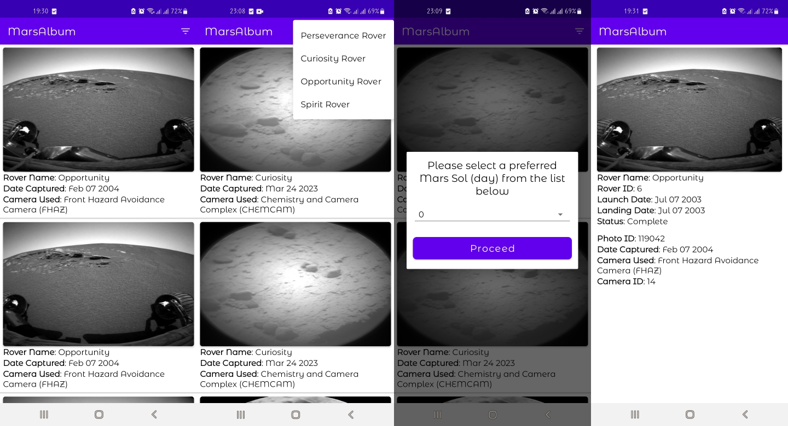

<p align="center">
  
</p>

# MarsAlbum

MarsAlbum is an Android Application that fetches and displays image data gathered by NASA's Curiosity, Perseverance, Opportunity and Spirit rovers on Mars. The App fetches the data from [NASA API](https://api.nasa.gov/). Each rover has its own set of photos and are being queried separately. The App has a Splash Screen, a Home page showing a list of images (and data) captured by a rover on a particular day. A user can filter for images captured by any rover on any particular Mars Sol. When an image is selected, more details about the image and rover are displayed on a details page. It is implemented using Clean Architecture, Model-View-ViewModel (MVVM) pattern and uses Modern Android Development pattern and libraries. Adequate Unit Tests were also implemented in the codebase.

Get the sample [APK here](https://github.com/mayorJAY/MarsAlbum/blob/main/media/MarsAlbum.apk)

## Screenshots

<p align="center">
  
</p>

## Project Characteristics

This application has the following characteristics:
* 100% Kotlin
* Modern Architecture (Clean Architecture, Model-View-ViewModel (MVVM))
* [Android Jetpack Components](https://developer.android.com/jetpack)
* [Material Design](https://material.io/develop/android/docs/getting-started)

## Tech Stack

Minimum API level is set to 21, this means HolidayInfo can run on approximately 98% of Android devices
* [Splash Screen](https://developer.android.com/develop/ui/views/launch/splash-screen), the standard recommended Splash Screen library for Android Applications
* [Retrofit](https://square.github.io/retrofit/) which is a type-safe REST client for Android which makes it easier to consume RESTful web services
* [Moshi](https://github.com/square/moshi), a modern JSON library for Android, Java and Kotlin
* [OkHttp Logging Interceptor](https://github.com/square/okhttp/tree/master/okhttp-logging-interceptor), an OkHttp interceptor which logs HTTP request and response data
* [Kotlin Coroutines](https://developer.android.com/kotlin/coroutines) used to perform asynchronous network calls to the remote server
* [Paging Library](https://developer.android.com/topic/libraries/architecture/paging) which helps to load and display small chunks of data at a time
* [Room](https://developer.android.com/training/data-storage/room), a persistence library with an abstraction layer over SQLite for database manipulation
* [Hilt](https://dagger.dev/hilt/), a DI library for Android that reduces the boilerplate of using manual DI
* [ViewModel](https://developer.android.com/topic/libraries/architecture/viewmodel) used to store and manage UI-related data in a lifecycle conscious way
* [LiveData](https://developer.android.com/topic/libraries/architecture/livedata) which is an observable data holder class used to handle data in a lifecycle-aware manner
* [View Binding](https://developer.android.com/topic/libraries/view-binding) used to easily write code that interacts with views by referencing them directly
* [Kotlin flow](https://developer.android.com/kotlin/flow) for emitting live updates from a network call sequentially
* [Material Design](https://material.io/develop/android/docs/getting-started/) which is an adaptable system that guides in maintaining principles and best practices of contemporary UI
* [Timber](https://github.com/JakeWharton/timber), a utility library for logging and easy debugging
* [SearchableSpinner](https://github.com/miteshpithadiya/SearchableSpinner), a dialog spinner with a search feature which allows users to search the items loaded in the spinner
* [SDP/SSP](https://github.com/intuit/sdp) which is a scalable size unit that scales with the screen size. It helps to easily design for multiple screens
* [JUnit4](https://junit.org/junit4), a testing framework used for writing unit tests
* [MockWebServer](https://javadoc.io/doc/com.squareup.okhttp3/mockwebserver/3.14.9/overview-summary.html), a library that makes it easy to test how Apps behave when making HTTP/HTTPS calls
* [Mockito](https://site.mockito.org/), a mocking framework for writing unit tests

## Installation

You will need an API key from [NASA API](https://api.nasa.gov/), although the API provides a demo API key. In your project's root directory, inside the `local.properties` file, include the following line:

````
api.key=YOUR_API_KEY
````